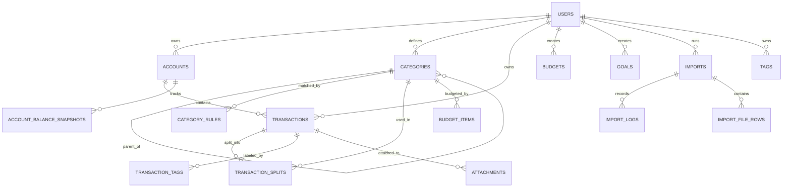

# Model bazy danych

## Cele

The database must support:

- multi-account personal finance tracking
- transaction import and deduplication
- budget planning and reporting
- investment and asset tracking
- hierarchical categories and automated rules
- auditability and future integrations

The model is designed for PostgreSQL and EF Core.

## Zasady projektowe

- use UUID primary keys for all core tables
- keep money values as decimal with explicit currency
- store raw import data separately from normalized domain data
- preserve auditability for financial operations
- optimize reads with targeted indexes, not premature denormalization
- support soft delete where business meaning requires historical retention

## Główne encje

### Users

Represents an authenticated person owning financial data.

Key fields:

- `Id`
- `Email`
- `NormalizedEmail`
- `PasswordHash`
- `DisplayName`
- `DefaultCurrency`
- `TimeZone`
- `Culture`
- `IsActive`
- `CreatedAt`
- `UpdatedAt`

Relationships:

- one-to-many with accounts
- one-to-many with categories
- one-to-many with budgets
- one-to-many with goals
- one-to-many with imports

### Accounts

Represents all financial accounts:

- bank
- cash
- brokerage
- investment
- crypto
- manual

Key fields:

- `Id`
- `UserId`
- `Name`
- `Type`
- `Currency`
- `InstitutionName`
- `ExternalAccountId`
- `Iban`
- `IsArchived`
- `OpenedAt`
- `ClosedAt`
- `CreatedAt`
- `UpdatedAt`

Relationships:

- one-to-many with transactions
- one-to-many with account balance snapshots
- one-to-many with import mappings

### Transactions

Canonical financial events.

Key fields:

- `Id`
- `UserId`
- `AccountId`
- `ImportedTransactionId` nullable
- `OccurredAt`
- `BookedAt`
- `Amount`
- `Currency`
- `Direction`
- `Status`
- `IsArchived` is represented operationally by the `Archived` status; archived transactions are hidden from the active list.
- `Description`
- `CounterpartyName`
- `CounterpartyAccount`
- `Iban`
- `Merchant`
- `CategoryId` nullable
- `TransactionType`
- `IsSplit`
- `IsReconciled`
- `ReferenceNumber`
- `ExternalTransactionId`
- `CreatedAt`
- `UpdatedAt`

Transaction status values currently used by the application include `Imported`,
`Manual` and `Ignored`. A category assignment is the source of
truth for the current "confirmed" transaction filter.

Relationships:

- many-to-one with account
- many-to-one with category
- one-to-many with transaction splits
- one-to-many with attachments
- one-to-many with audit log entries through entity references

### TransactionSplits

Allows one transaction to be allocated across multiple categories.

Key fields:

- `Id`
- `TransactionId`
- `CategoryId`
- `Amount`
- `Memo`
- `CreatedAt`

### Categories

Hierarchical user-defined classification tree.

Key fields:

- `Id`
- `UserId`
- `ParentId` nullable
- `Name`
- `Color`
- `Icon`
- `SortOrder`
- `IsSystem`
- `IsArchived`
- `CreatedAt`
- `UpdatedAt`

Relationships:

- recursive self-reference
- one-to-many with transaction splits
- one-to-many with category rules
- one-to-many with budgets

### CategoryRules

Automatic categorization rules.

### Budgets and BudgetItems

`Budgets` stores a user's monthly budget period. `BudgetItems` stores one planned
amount per category for that period.

Key `Budgets` fields:

- `UserId`
- `Name`
- `PeriodType`
- `StartDate`
- `EndDate`
- `Currency`
- `IsActive`

Key `BudgetItems` fields:

- `BudgetId`
- `CategoryId`
- `PlannedAmount`
- `Comment` nullable, maximum 160 characters

The combination of `BudgetId` and `CategoryId` is unique. Real spending is
calculated from negative, non-`Ignored` transactions in the budget month and
matching `CategoryId`. The remaining amount is calculated at read time as
`PlannedAmount - ActualAmount`.

Key fields:

- `Id`
- `UserId`
- `CategoryId`
- `Priority`
- `IsEnabled`
- `ConditionType`
- `ConditionValue`
- `AmountOperator` nullable
- `AmountValue` nullable
- `CounterpartyValue` nullable
- `CreatedAt`
- `UpdatedAt`

Supported conditions:

- contains
- startsWith
- regex
- amount greater than
- amount less than
- IBAN match
- counterparty match

### Tags

Flexible labels assigned to transactions.

Key fields:

- `Id`
- `UserId`
- `Name`
- `Color`
- `CreatedAt`

Join table:

- `TransactionTags`

### Budgets

Budget definitions by month or year.

Key fields:

- `Id`
- `UserId`
- `Name`
- `PeriodType`
- `StartDate`
- `EndDate`
- `Currency`
- `IsActive`
- `CreatedAt`
- `UpdatedAt`

Join table:

- `BudgetItems`
  - `BudgetId`
  - `CategoryId`
  - `PlannedAmount`
  - `AlertThresholdPercent`

### Goals

Savings targets.

Key fields:

- `Id`
- `UserId`
- `Name`
- `TargetAmount`
- `CurrentAmount`
- `Currency`
- `TargetDate`
- `Status`
- `CreatedAt`
- `UpdatedAt`

Join table:

- `GoalContributions`

### Assets

Generic net worth items.

Key fields:

- `Id`
- `UserId`
- `Name`
- `AssetType`
- `CurrentValue`
- `Currency`
- `AcquiredAt`
- `DisposedAt`
- `IsActive`
- `CreatedAt`
- `UpdatedAt`

### InvestmentAccounts

Brokerage or investment portfolios.

Key fields:

- `Id`
- `UserId`
- `Name`
- `BrokerName`
- `Currency`
- `ExternalAccountId`
- `IsArchived`
- `CreatedAt`
- `UpdatedAt`

### InvestmentTransactions

Operations on investment accounts.

Key fields:

- `Id`
- `InvestmentAccountId`
- `OccurredAt`
- `TransactionType`
- `Symbol`
- `Quantity`
- `Price`
- `Fees`
- `Amount`
- `Currency`
- `Description`
- `ExternalTransactionId`
- `CreatedAt`

### Subscriptions

Recurring fixed costs or income.

Key fields:

- `Id`
- `UserId`
- `Name`
- `Merchant`
- `CategoryId`
- `Frequency`
- `ExpectedAmount`
- `Currency`
- `NextOccurrenceAt`
- `IsActive`
- `CreatedAt`
- `UpdatedAt`

### Imports

Represents a single import batch.

Key fields:

- `Id`
- `UserId`
- `AccountId`
- `SourceType`
- `SourceFileName`
- `SourceHash`
- `Status`
- `ImportedRowsCount`
- `CreatedRowsCount`
- `SkippedRowsCount`
- `DuplicateRowsCount`
- `FailedRowsCount`
- `StartedAt`
- `FinishedAt`
- `CreatedAt`

### ImportLogs

Detailed row-level logs for imports.

Key fields:

- `Id`
- `ImportId`
- `RowNumber`
- `Level`
- `Message`
- `RawPayload`
- `CreatedAt`

### Attachments

Files linked to transactions and other entities.

Key fields:

- `Id`
- `UserId`
- `FileName`
- `ContentType`
- `StoragePath`
- `FileSize`
- `Checksum`
- `CreatedAt`

### AuditLog

Immutable history of business-relevant changes.

Key fields:

- `Id`
- `UserId`
- `EntityName`
- `EntityId`
- `Action`
- `BeforeJson`
- `AfterJson`
- `CorrelationId`
- `OccurredAt`

## Tabele pomocnicze

### AccountBalanceSnapshots

Stores historical balance observations for reporting.

Fields:

- `Id`
- `AccountId`
- `AsOfDate`
- `Balance`
- `Currency`
- `CreatedAt`

### CategoryMergeMap

Supports category merging operations safely.

Fields:

- `Id`
- `UserId`
- `SourceCategoryId`
- `TargetCategoryId`
- `CreatedAt`

### ExternalIntegrations

Tracks OAuth and sync credentials metadata without exposing secrets directly.

Fields:

- `Id`
- `UserId`
- `Provider`
- `ExternalUserId`
- `AccessTokenRef`
- `RefreshTokenRef`
- `ExpiresAt`
- `CreatedAt`
- `UpdatedAt`

## Model surowego importu

Raw file rows must be preserved for troubleshooting and reprocessing.

Suggested tables:

- `ImportFiles`
- `ImportFileRows`

This is especially important for bank parsers like Pekao, PKO, ING, Santander, mBank, Revolut, MT940, and OFX.

## Kluczowe relacje

## Strategia indeksowania

Recommended indexes:

- `Transactions(UserId, AccountId, OccurredAt DESC)`
- `Transactions(UserId, OccurredAt DESC)`
- `Transactions(UserId, CategoryId, OccurredAt DESC)`
- `Transactions(UserId, CounterpartyName)`
- `Transactions(UserId, ExternalTransactionId)` unique where provided
- `Accounts(UserId, Type, IsArchived)`
- `Categories(UserId, ParentId)`
- `CategoryRules(UserId, IsEnabled, Priority)`
- `Imports(UserId, AccountId, CreatedAt DESC)`
- `AuditLog(UserId, OccurredAt DESC)`

## Ograniczenia

Important constraints:

- unique email per user
- unique external account identifiers within provider scope
- no duplicate transaction imports for the same source hash and account
- category parent cannot point to itself
- transaction split totals should equal the parent transaction amount
- only one active budget definition per period and scope when business rules require it

## Obsługa pieniędzy

Money should be stored as:

- decimal amount with fixed precision, for example `decimal(18,2)` for fiat currencies
- explicit `Currency` code using ISO 4217

For instruments or crypto where higher precision is needed, use a dedicated precision strategy in the relevant tables.

## Praktyczne uwagi dotyczące EF Core

- use shadow properties sparingly
- configure owned value objects for money and identifiers where appropriate
- keep migrations small and reviewable
- define concurrency tokens on mutation-heavy aggregates
- add query-specific read models only when profiling shows a need

## Kolejność implementacji

1. identity and users
2. accounts and categories
3. transactions and imports
4. category rules and tags
5. budgets and goals
6. assets and investments
7. audit log and attachments
8. reporting projections
